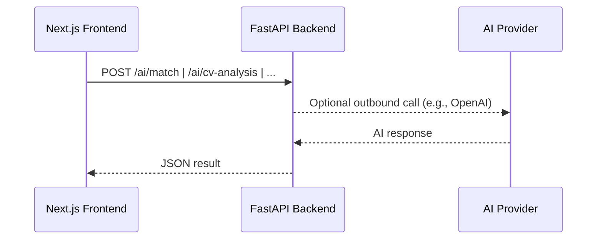
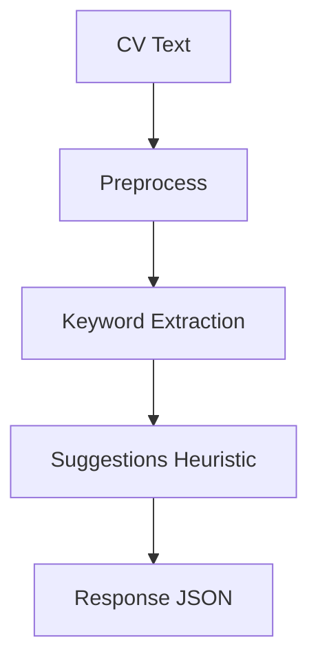
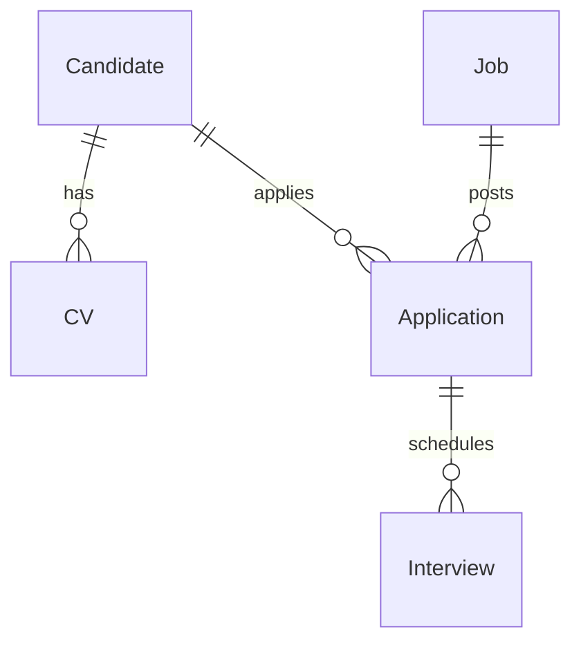

# Niyog

AI-powered recruiting platform with a Next.js frontend and a FastAPI backend (on the `Python` branch) for smart matching, CV analysis, interview simulation, and growth insights.

<div align="center">

[](https://nextjs.org/)
[](https://reactjs.org/)
[](https://fastapi.tiangolo.com/)
[](https://tailwindcss.com)
[](https://openai.com)
[](https://www.docker.com/)

</div>

## 🌟 Overview

Niyog helps employers and job seekers with:
- Smart job matching and candidate pipelines
- CV analysis and improvement suggestions
- Interview simulation and structured feedback
- Profile insights and growth recommendations

The web app runs on Next.js (frontend). AI endpoints live in a separate FastAPI service inside `python/` and are developed exclusively on the `Python` branch so `main` stays clean.

## 📁 Monorepo layout

```
app/               # Next.js app (App Router)
components/        # UI & feature components (shadcn/ui based)
data/              # Mock/demo data
hooks/             # Client hooks
lib/               # Shared utilities
public/            # Static assets
python/            # FastAPI backend (lives & evolves on branch: Python)
```

## 🚀 Features (highlights)

- Employer dashboard, jobs management, candidate pipeline
- Interview simulator (voice/video/text modes), feedback & analytics
- AI endpoints for match, CV analysis, profile analysis, blind spots, growth
- Responsive UI with Tailwind + shadcn/ui

## 🔌 Backend (FastAPI) — Python branch only

The AI backend is isolated in `python/` and only pushed to the `Python` branch. Main branch is not modified by backend work.

Windows PowerShell quick start:

```powershell
# ensure you're on the Python branch for backend changes
git checkout Python

cd python
python -m venv .venv
.\.venv\Scripts\Activate.ps1
pip install -r requirements.txt
Copy-Item .env.example .env
# set OPENAI_API_KEY in .env if you plan to use /ai/complete
uvicorn src.app:app --reload --port 8000
```

The API will be available at http://localhost:8000

### Available endpoints

- GET `/health`
- POST `/ai/echo`
- POST `/ai/complete` (needs `OPENAI_API_KEY`)
- POST `/ai/match`
- POST `/ai/cv-analysis`
- GET `/ai/cv-analysis`
- POST `/ai/analyse-profile`
- POST `/ai/interview-simulator`
- POST `/ai/blind-spots`
- POST `/ai/growth-insights`

See `python/README.md` for curl examples, Docker, and tests.

## 🖥 Frontend (Next.js)

Dev server (from repo root):

```powershell
pnpm install
pnpm dev
# opens http://localhost:3000
```

When calling the backend in dev, target `http://localhost:8000`.

## ⚙️ Environment variables

Frontend (example `.env.local` in repo root):

```
# add your frontend env vars here as needed
NEXT_PUBLIC_API_BASE=http://localhost:8000
```

Backend (copy `python/.env.example` to `python/.env`):

```
OPENAI_API_KEY=sk-your-key-here
ALLOWED_ORIGINS=http://localhost:3000
```

## 🧪 Tests (backend)

```powershell
cd python
python -m venv .venv
.\.venv\Scripts\Activate.ps1
pip install -r requirements.txt
pytest -q
```

## 🐳 Docker (backend, optional)

```powershell
cd python
docker build -t niyog-fastapi .
docker run -p 8000:8000 --env-file .env niyog-fastapi
```

## 🧭 Architecture (draft)

High-level request flow:



AI workflow (example: CV Analysis):



Data sketch (future-state, illustrative):



## 📦 Contributing

- Frontend changes target `main` as usual.
- Backend/AI changes target the `Python` branch only. Open PRs from `Python` to `main` when ready.

## 📜 License

MIT — see LICENSE

---

Notes
- This README describes the current state and planned direction. Diagrams are drafts and will evolve as persistence/auth are added.
